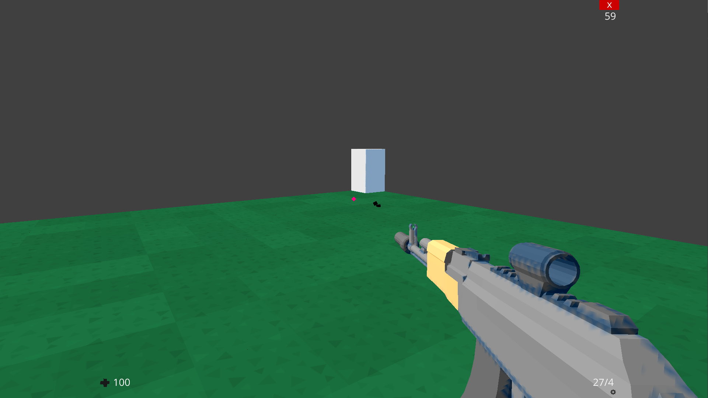
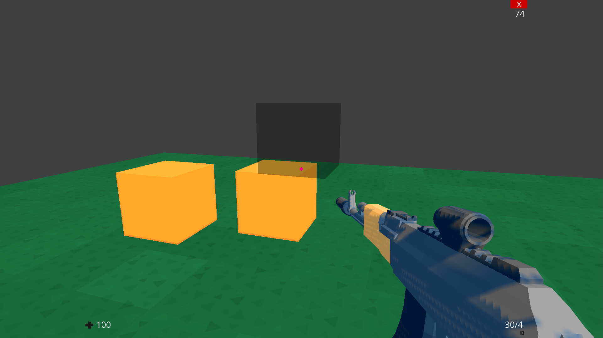
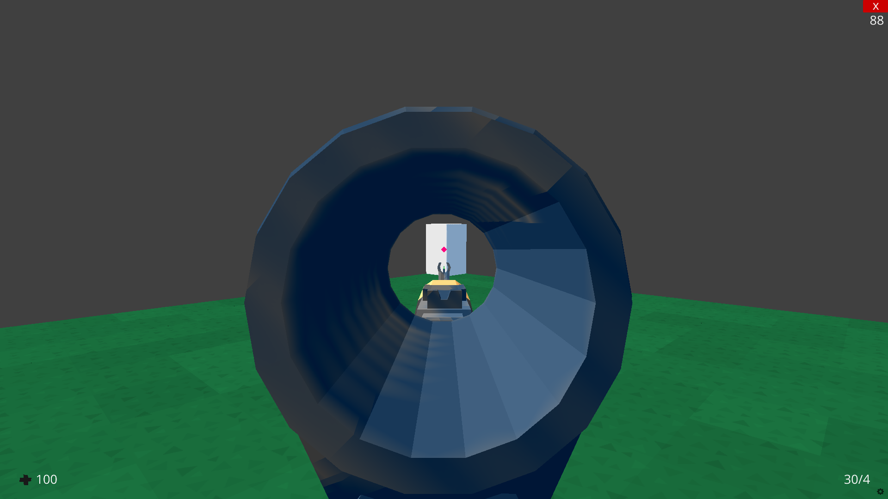
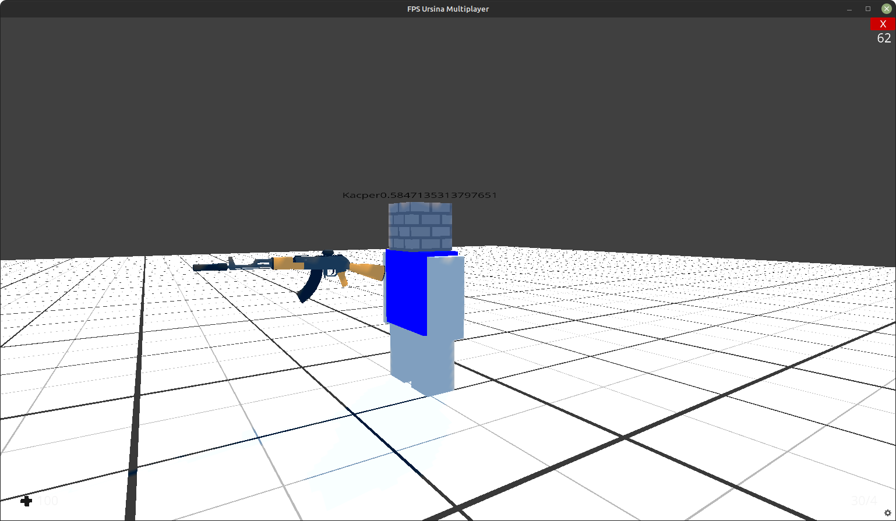

# FPS-Game-Ursina-Engine
Online game combining CS GO, Rainbow six siege, Team fortress 2

Basic multiplayer

# WORKING

 - Shooting (Reload, Aim, recoil)
 - Change of weapons
 - Basic multiplayer

# TODO

- Round (plant, reset...)
- Bullet holes
- Aim change fov
- Own FirstPersonController
- Buying weapons at the start of the round
- Better particle system
- Grenades (hard to do)
- Drop weapons (hard to do)
- Antialiasing (hard to do)
- Settings
- LVL Editor
- log

